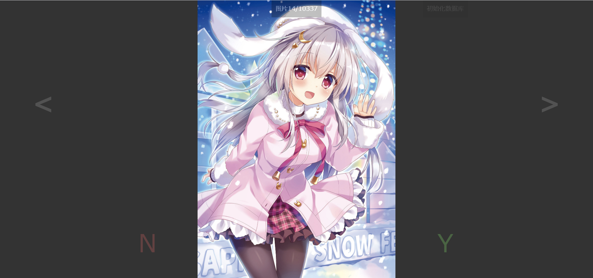

# HTMLImageViewer
PHP+HTML+CSS+JS PC/Mobile manually image filter

# What can this do?

This is a image manually filter.if you have some images to manually choice what images should use or not.simplly to press Z X R and left arrow right arrow and mouse click to control all things.

# Usage

First,Create 3 folders.1 for all pics, 1 for dropped pics, 1 for images which you need.

Then,modify the PHPfile,check the $confdir if the folder name is not same as php file.

Put your all images file to the all pics folder,then run the php with the parameter "?init=true",then the program will init the database file.

Finally,you can see image.Use mouse click N or Y to select pictures,also you can use Z for decline and X for accept.double press R key to reset database or double click the Database Init button to init the index database.

# ScreenShot

# Credit and copyright
Special thanks for <a href="https://github.com/tongyuantongyu">TYTY</a>.the part of CSS and JavaScrpt is licensed by TYTY with MIT.

This project also licensed with MIT.

# HTML网页版图像查看/筛选器
PHP+HTML+CSS+JS PC/手机端均支持的手动图像选择器

# 这东西能做什么？

用来从一堆图中选出你想要的图，比如有的图你不想要，有的图你还想留着，只需要按Z X R键和左右方向键或者鼠标就可以控制所有事情。

# 使用方法

首先建立三个文件夹，一个装全部图，另外两个空着，分别用来装不要的图和要的图。

然后修改PHP文件的$confdir变量，修改字符串的名字为你创建的那几个文件夹的名字。

把你所有图片放到全部图的文件夹里，运行php脚本，参数是?init=true.然后程序会自动检索文件并建立索引数据库。

然后你会看到一张图片，随后可以使用N或者Y来决定该图片是否应该留下，Z拒绝X留下，双击R重建索引，或者双击重建数据库按钮也可以重建索引。

# 截图

# 特别感谢与版权信息
特别感谢<a href="https://github.com/tongyuantongyu">TYTY</a>的CSS和JavaScript前端支持，前端部分由TYTY使用MIT协议授权使用。

本项目同样使用MIT协议发布。

# HTMLオンラインイラストブラウザー
PHP+HTML+CSS+JS PC/携帯でも使える手動画像フィルター

# このスクリプトは何ができますか？

たくさんのイラストがあって、好きな、嫌なイラストが混ぜ合わせる。好きか嫌やかイラストが割りたい。ZXRキーだけで使ってもイラストの選択のことができます。

# 利用方法

まずは三つフォルダを作成する。一つは全部のイラスト置き場、一つは好きなイラスト置き場、一つは嫌なイラスト置き場。

それからPHPファイルの$confdirを編集する。作成したフォルダどおりに変更をお願いします。

すべてのイラストは全部のイラスト置き場に入れて、PHPスクリプトを?init=trueがパラメータとして実行する。それからプログラムは自動的にファイルのインデックスを作成する。

ついに、イラストが見られます。Zキーは拒否、Xキーは許す。ダブルクリックRキーはインデックスを再作成。またダブルクリックデックスを再作成のボタンもできます。

# スクリーンショット

# 特別な感謝と著作権情報
特別な感謝<a href="https://github.com/tongyuantongyu">TYTY</a>さんのCSSとJavaScriptの協力しています。CSSとJavaScriptの部には、TYTYさんからMITに基づく利用しています。

このプロジェクトもMITに基づく配布と公開しています。
